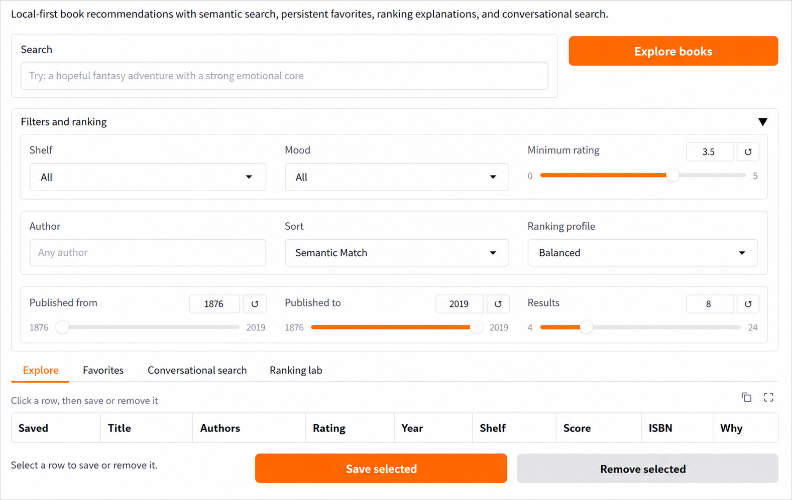

# LocalShelf Explorer

LocalShelf Explorer is a local-first book discovery app that helps users find books with natural-language search, lightweight mood filtering, and offline-friendly recommendations. It uses local embeddings, a persistent Chroma vector database, and free Hugging Face models so the core recommendation flow can run on a personal laptop without paid APIs. Instead of relying only on keyword search, the app lets users describe what they want to read in plain language, such as "a tense historical mystery" or "a medieval China-inspired kingdom-building story", and then returns relevant matches from a prepared local catalog.

## Why this project matters

This project is a small but practical example of local AI applied to a real user problem: content discovery. It shows how semantic retrieval, lightweight ML enrichment, and local-first design can work together in a usable product.

The same pattern can be extended beyond books to other discovery workflows such as ecommerce catalogs, learning resources, internal knowledge bases, or media recommendation systems.


## Demo / Architecture



LocalShelf combines a local data-preparation pipeline with a Gradio discovery interface:

* Cleaned book metadata is enriched with categories, descriptions, ratings, and emotion scores.
* Sentence Transformers converts natural-language queries and book descriptions into local embeddings.
* Chroma stores the vector index and returns semantically similar books for each search.
* A ranking layer blends semantic match, keyword match, mood alignment, and reader rating.
* The UI shows recommendation explanations, saved books, ranking metrics, and conversational search.
* Local JSON files persist favorites and interaction events for future learned-ranking experiments.


## Key features

This project is centered around a local workflow.

* It uses a local Sentence Transformers embedding model instead of paid embedding APIs.
* It persists a local Chroma vector database on disk.
* It includes a preparation script that generates the local files the app needs.
* It supports offline startup after the required model has been cached.
* It offers two discovery modes:
  * semantic search when a query is provided
  * browse mode when the query is left blank

The Gradio app is shaped as a browsing tool. It includes:

* an interface named `LocalShelf Explorer`
* shelf and mood filters
* minimum-rating filtering
* multiple sort modes
* card-style recommendations with metadata summaries
* persistent saved books stored in local JSON
* recommendation explanations for semantic, keyword, mood, and rating signals
* ranking profiles and lightweight evaluation metrics for tuning
* conversational search that rewrites recent chat context into book-search queries

## Tech stack

* Python
* Gradio
* Pandas
* NumPy
* Chroma vector database
* Sentence Transformers
* Hugging Face Transformers


## Project layout

Core files:

* `localshelf_explorer.py`  
  Runs the local web app and renders the recommendation interface.
* `build_localshelf_catalog.py`  
  Prepares the local dataset, emotion scores, tagged descriptions, and vector store.
* `localshelf_embeddings.py`  
  Loads the local embedding model in offline-friendly mode.
* `prepare_deploy.py`  
  Builds the Chroma vector store for cloud deployment without re-running the full catalog pipeline.
* `app.py`  
  Deployment entry point for Hugging Face Spaces, Render, and Railway.

Generated local assets:

* `books_cleaned.csv`
* `books_with_emotions.csv`
* `tagged_description.txt`
* `chroma_db/`
* `.hf-cache/`

Supporting files:

* `requirements.txt`
* `requirements-local.txt`
* `cover-not-found.jpg`
* notebooks for data exploration and experimentation

## How it works

The project follows a small local retrieval pipeline:

1. A source book dataset is loaded or reused locally.
2. The dataset is cleaned and reduced to books with enough descriptive text.
3. A simple category mapping is added to support shelf-style filtering.
4. An emotion classifier scores each book description.
5. Tagged descriptions are written into a local text file.
6. A Chroma vector store is built using the cached local embedding model.
7. The Gradio app loads the vector store and lets you search or browse the catalog.

## Local setup

Run the commands below from this folder:

```powershell
python -m pip install -r requirements-local.txt
python build_localshelf_catalog.py
python localshelf_explorer.py
```

What these commands do:

1. Install the local dependencies needed by the app and preprocessing pipeline.
2. Prepare the cleaned dataset, emotion scores, tagged descriptions, and vector database.
3. Launch the Gradio interface locally.

After startup, the app runs on a local Gradio server in your browser.

## Offline behavior

After the required model files have been downloaded and cached once, the core recommendation workflow can run offline.

* local model loading
* local semantic search
* local vector database access
* local filtering and ranking
* local Gradio app on `127.0.0.1`
* persistent favorites in `saved_books.json`

Current limitation:

* many book covers still come from remote thumbnail URLs stored in the dataset, so recommendation cards may appear without cover images when the internet is off

## App behavior

The dashboard supports:

* natural-language semantic search
* conversational search with recent-chat context
* blank-query browsing mode
* shelf filtering by simplified categories
* mood filtering using local emotion scores
* minimum-rating filtering
* result sorting by semantic match, rating, recency, shorter reads, or saved-first
* ranking profiles for balanced, semantic-heavy, keyword-heavy, mood-heavy, and popularity-heavy results
* local saved-books management

Each result card shows:

* title
* author list
* short description preview
* why the result was recommended
* category
* average rating
* publication year
* page count

## Ranking and Evaluation

LocalShelf uses a composite score that blends semantic retrieval order, keyword matches, mood alignment, and reader rating. The Ranking Lab tab reports lightweight metrics such as result coverage, average final score, keyword hit rate, mood alignment, and saved-result rate.

Save and remove events are written to `ranking_interactions.jsonl`. This creates a simple event log that can later support learned ranking, offline evaluation, or A/B testing of ranking profiles.

## Favorites

Saved books are stored in `saved_books.json` and survive app restarts. Select a row in the results table, then use Save selected or Remove selected. The Favorites tab shows the current reading list.

## Notes

* `build_localshelf_catalog.py` reuses `books_cleaned.csv` if it already exists.
* The local embedding loader is configured to prefer cached files and offline startup.
* If you delete `.hf-cache/` or `chroma_db/`, run `python prepare_deploy.py` or `python build_localshelf_catalog.py` to rebuild the vector store.
* `.hf-cache/`, `chroma_db/`, `saved_books.json`, and `ranking_interactions.jsonl` are local runtime files and are ignored by Git.

## Portfolio value

LocalShelf Explorer demonstrates practical skills in data preparation, semantic retrieval, offline-friendly ML workflows, vector search, and user-focused interface design. It is positioned not just as a demo app, but as a foundation for real-world recommendation and discovery systems.


## Future improvements

Some natural next steps for this project:

* download cover images locally for a more complete offline experience
* package the app into a cleaner desktop-friendly launcher
* replace heuristic ranking with a learned ranker trained from saved-book interactions
* run live A/B tests between ranking profiles after deployment

